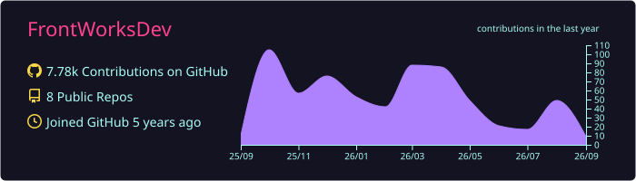
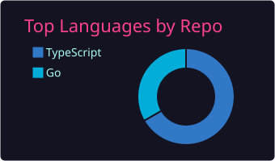
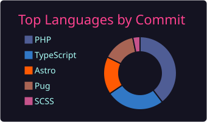
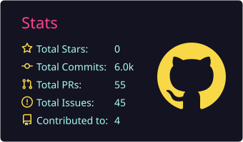

<h1 align="center">Hi 👋, I'm FrontWorksDev</h1>
<p align="center">Front-end Engineer</p>

<p align="center">
  <a href="https://frontworks.dev">🌐 Portfolio</a> ・
  <a href="https://twitter.com/FrontWorksDev">🐦 Twitter</a>
</p>

---

## Summary
<p align="center">
  
  
  
  
  
</p>

## ⏱ Weekly Coding Stats
<!--START_SECTION:waka-->


**I'm an Early 🐤** 

```text
🌞 Morning                44 commits          ██░░░░░░░░░░░░░░░░░░░░░░░   09.46 % 
🌆 Daytime                241 commits         █████████████░░░░░░░░░░░░   51.83 % 
🌃 Evening                158 commits         ████████░░░░░░░░░░░░░░░░░   33.98 % 
🌙 Night                  22 commits          █░░░░░░░░░░░░░░░░░░░░░░░░   04.73 % 
```
📅 **I'm Most Productive on Sunday** 

```text
Monday                   50 commits          ███░░░░░░░░░░░░░░░░░░░░░░   10.75 % 
Tuesday                  30 commits          ██░░░░░░░░░░░░░░░░░░░░░░░   06.45 % 
Wednesday                20 commits          █░░░░░░░░░░░░░░░░░░░░░░░░   04.30 % 
Thursday                 11 commits          █░░░░░░░░░░░░░░░░░░░░░░░░   02.37 % 
Friday                   44 commits          ██░░░░░░░░░░░░░░░░░░░░░░░   09.46 % 
Saturday                 72 commits          ████░░░░░░░░░░░░░░░░░░░░░   15.48 % 
Sunday                   238 commits         █████████████░░░░░░░░░░░░   51.18 % 
```


📊 **This Week I Spent My Time On** 

```text
🕑︎ Time Zone: Asia/Tokyo

💬 Programming Languages: 
TypeScript               4 hrs 21 mins       ███████████░░░░░░░░░░░░░░   42.48 % 
Astro                    2 hrs 28 mins       ██████░░░░░░░░░░░░░░░░░░░   24.06 % 
Markdown                 1 hr 13 mins        ███░░░░░░░░░░░░░░░░░░░░░░   11.88 % 
Liquid                   59 mins             ██░░░░░░░░░░░░░░░░░░░░░░░   09.59 % 
Other                    26 mins             █░░░░░░░░░░░░░░░░░░░░░░░░   04.32 % 

🔥 Editors: 
Claude Code              10 hrs 6 mins       █████████████████████████   98.49 % 
Neovim                   9 mins              ░░░░░░░░░░░░░░░░░░░░░░░░░   01.51 % 

💻 Operating System: 
Mac                      10 hrs 15 mins      █████████████████████████   100.00 % 
```

🤖 **AI Coding This Week** 

```text
⏱ AI Coding Time: 10 hrs 7 mins (98.74%)

✍️ 2,729 lines written by AI, 0 lines written by hand (100.0% AI-written)

🔤 1,444,901 Input Tokens, 419,106 Output Tokens

💵 $87.32 Estimated AI Cost This Week

🧠 28 AI Sessions, 80 AI Prompts

Opus                     2,803 lines         █████████████████████████   100.00 % 

🔎 AI Coding Insights:
🤖 AI-Driven — 100.0% of written lines came from AI
📚 Verbose Prompter — average 1,895 characters per prompt
🔁 Iterative Prompter — average 3 prompts per session
🚀 High AI Trust — 0.0% of changed lines were hand-edited
```

**I Mostly Code in TypeScript** 

```text
TypeScript               5 repos             ████████████████░░░░░░░░░   62.50 % 
Go                       2 repos             ██████░░░░░░░░░░░░░░░░░░░   25.00 % 
JavaScript               1 repo              ███░░░░░░░░░░░░░░░░░░░░░░   12.50 % 
```


**Timeline**


 Last Updated on 18/08/2026 00:09:20 UTC
<!--END_SECTION:waka-->
