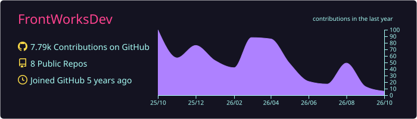
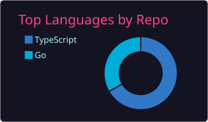
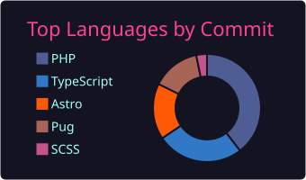
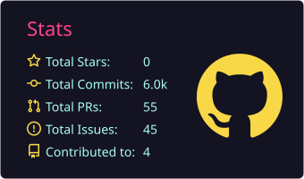

<h1 align="center">Hi 👋, I'm FrontWorksDev</h1>
<p align="center">Front-end Engineer</p>

<p align="center">
  <a href="https://frontworks.dev">🌐 Portfolio</a> ・
  <a href="https://twitter.com/FrontWorksDev">🐦 Twitter</a>
</p>

---

## Summary
<p align="center">
  
  
  
  
  
</p>

## ⏱ Weekly Coding Stats
<!--START_SECTION:waka-->


**I'm an Early 🐤** 

```text
🌞 Morning                44 commits          ██░░░░░░░░░░░░░░░░░░░░░░░   09.46 % 
🌆 Daytime                241 commits         █████████████░░░░░░░░░░░░   51.83 % 
🌃 Evening                158 commits         ████████░░░░░░░░░░░░░░░░░   33.98 % 
🌙 Night                  22 commits          █░░░░░░░░░░░░░░░░░░░░░░░░   04.73 % 
```
📅 **I'm Most Productive on Sunday** 

```text
Monday                   49 commits          ███░░░░░░░░░░░░░░░░░░░░░░   10.54 % 
Tuesday                  30 commits          ██░░░░░░░░░░░░░░░░░░░░░░░   06.45 % 
Wednesday                20 commits          █░░░░░░░░░░░░░░░░░░░░░░░░   04.30 % 
Thursday                 11 commits          █░░░░░░░░░░░░░░░░░░░░░░░░   02.37 % 
Friday                   44 commits          ██░░░░░░░░░░░░░░░░░░░░░░░   09.46 % 
Saturday                 73 commits          ████░░░░░░░░░░░░░░░░░░░░░   15.70 % 
Sunday                   238 commits         █████████████░░░░░░░░░░░░   51.18 % 
```


📊 **This Week I Spent My Time On** 

```text
🕑︎ Time Zone: Asia/Tokyo

💬 Programming Languages: 
TypeScript               1 hr 54 mins        ██████████░░░░░░░░░░░░░░░   41.09 % 
Markdown                 1 hr 4 mins         ██████░░░░░░░░░░░░░░░░░░░   23.00 % 
JavaScript               25 mins             ██░░░░░░░░░░░░░░░░░░░░░░░   09.26 % 
CSS                      19 mins             ██░░░░░░░░░░░░░░░░░░░░░░░   07.11 % 
PHP                      18 mins             ██░░░░░░░░░░░░░░░░░░░░░░░   06.61 % 

🔥 Editors: 
Claude Code              4 hrs 36 mins       █████████████████████████   99.25 % 
Neovim                   2 mins              ░░░░░░░░░░░░░░░░░░░░░░░░░   00.75 % 

💻 Operating System: 
Mac                      4 hrs 39 mins       █████████████████████████   100.00 % 
```

🤖 **AI Coding This Week** 

```text
⏱ AI Coding Time: 4 hrs 39 mins (100.0%)

✍️ 5,594 lines written by AI, 0 lines written by hand (100.0% AI-written)

🔤 2,193,354 Input Tokens, 464,337 Output Tokens

💵 $32.30 Estimated AI Cost This Week

🧠 21 AI Sessions, 96 AI Prompts

Sonnet                   5,615 lines         █████████████████████████   100.00 % 
Opus                     0 lines             ░░░░░░░░░░░░░░░░░░░░░░░░░   00.00 % 

🔎 AI Coding Insights:
🤖 AI-Driven — 100.0% of written lines came from AI
📚 Verbose Prompter — average 1,860 characters per prompt
🔁 Iterative Prompter — average 5 prompts per session
🚀 High AI Trust — 0.0% of changed lines were hand-edited
```

**I Mostly Code in TypeScript** 

```text
TypeScript               5 repos             ████████████████░░░░░░░░░   62.50 % 
Go                       2 repos             ██████░░░░░░░░░░░░░░░░░░░   25.00 % 
JavaScript               1 repo              ███░░░░░░░░░░░░░░░░░░░░░░   12.50 % 
```


**Timeline**


 Last Updated on 04/10/2026 03:43:02 UTC
<!--END_SECTION:waka-->
